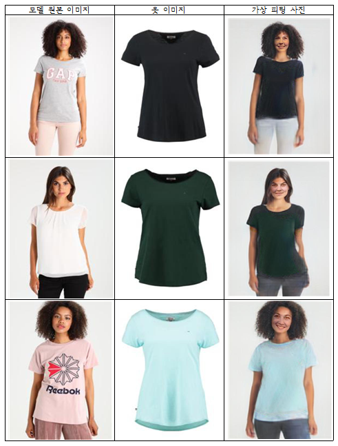

# OpenSource_Contest_2020

## Introduction
*  Members \
[KangsanKim07](https://github.com/KangsanKim07) \
[totolacky](https://github.com/totolacky) \
[HyeongshinYoon](https://github.com/HyeongshinYoon)

* Usage Languages \
Front-end: Vue.js \
Back-end: Flask \
DB: Firebase \
Etc: OpenCV, Pytorch, Tensorflow

## Directory Structure
<pre><code>OpenSource_Contest_2020
|- ownmodel_front
|- ownmodel_back
    |- app.py
    |- cp_viton
    |- face_crop
    |- face_swap
    |- data
</code></pre>

## Implementation
* Environments
  <pre><code>Python 3.6.8
  Pytorch 1.7.0, torchvision 0.8.1
  dlib 19.21.0</code></pre>
* Front-end Part
  <pre><code>$ cd ownmodel_front
  $ npm run serve</code></pre>
* Back-end Part
  <pre><code>$ cd ownmodel_back
  $ python app.py</code></pre>

## Results

 \
[Watch the video](https://www.youtube.com/watch?v=Z6GLrz0Pq2g&feature=youtu.be)

## References & Opensources

* CP-VTON : 
[dataset](https://onedrive.live.com/?cid=5435770760f02d2f&id=5435770760F02D2F%211156&authkey=!ABhfRrNiGogM8_o),
 [code](https://github.com/sergeywong/cp-vton)
    > Wear cloth on body

* StyleGAN :
[model](https://drive.google.com/file/d/1QlXFPIOFzsJyjZ1AtfpnVhqW4Z0r8GLZ/view),
 [code](https://github.com/rosinality/style-based-gan-pytorch)
    > Generate new faces \
    > Save the model at face_gen folder.

* FACE-SWAP
[code](https://github.com/BruceMacD/Face-Swap-OpenCV),
 [docs](https://www.learnopencv.com/face-swap-using-opencv-c-python/)
    >Change two faces

